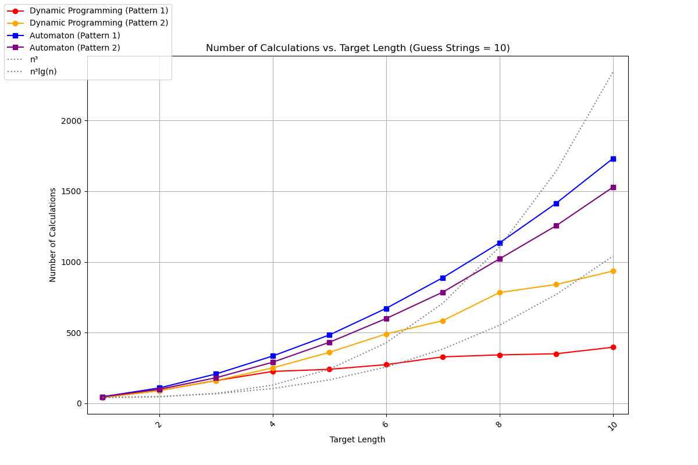
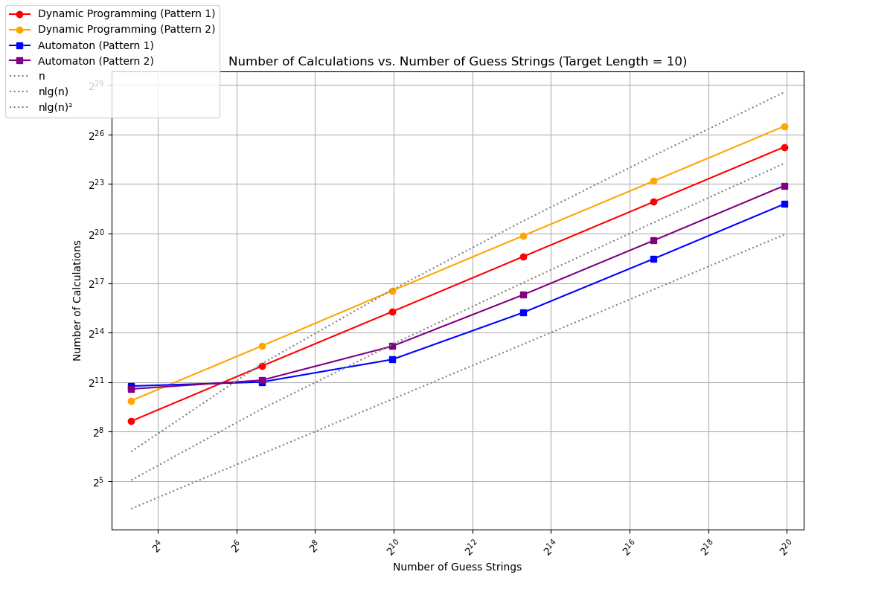

= Investigating Levenshtein Automata
Austin Bomhold
:pdf-folio-placement: footer
:pdf-themesdir: theme
:pdf-fontsdir: theme/fonts
:iconsdir: theme/icons
:pdf-theme: tutorial.yml
:title-page:

== Introduction

In computer science, a common problem is to determine the similarity between two strings.
This can be useful in various applications, such as error correction, DNA sequence alignment, and string searching.
The typical approach to this problem is calculating the edit distance between the two strings.
Levenshtein first introduced this concept, which is defined as the minimum number of single-character edits (insertions, deletions, or substitutions) required to change one string into the other.
Since then, many algorithms have been developed to calculate the edit distance between two strings, with the most common implementation being the dynamic programming algorithm.
The design is undoubtedly tractable, with a time complexity of O(n^2), but when you start to scale up the search space size, the runtime can become a bottleneck.

A common tactic when dealing with large amounts of data is to preprocess or index the data to speed up the search process.
A Levenshtein automaton is a finite-state machine that can efficiently calculate the Levenshtein distance between two strings.
While there are various ways to implement a Levenshtein automaton, a deterministic finite automaton (DFA) allows us to do preprocessing.
It works by starting with a target string and a maximum edit distance and then constructing a DFA that accepts all strings within the given edit distance of the target string.
After construction, the DFA can be traversed to find all strings within the edit distance of the target string in linear time.
This approach has the potential to be much faster than the dynamic programming algorithm, especially for large strings or large search spaces.
This brings us to a critical point: In which aspect does our search space grow, and how does each algorithm scale accordingly?
For this project, let a search space be defined by the size of the strings, the number of unique characters in the strings, and the number of strings we are comparing against.
Our goal is to determine how the runtimes of the dynamic programming algorithm and the Levenshtein automaton scale relative to the criteria.

== Algorithm Presentation

=== Dynamic Programming Algorithm

The dynamic programming algorithm, known for its efficiency, is based on the idea that the edit distance between two strings can be calculated by building a matrix of the edit distances between all prefixes of the two strings.
The matrix is built as the algorithm iterates through the guess and target strings for each guess, filling in the edit distance between prefixes.

[source,python]
----
def dynamic_lev(str1, str2, max_edits):
    str1_len = len(str1)
    str2_len = len(str2)
    calculations = 0

    previous_row = list(range(str2_len + 1))
    current_row = [0] * (str2_len + 1)

    for i in range(1, str1_len + 1):
        current_row[0] = i
        for j in range(1, str2_len + 1):
            calculations += 1
            if str1[i - 1] == str2[j - 1]:
                current_row[j] = previous_row[j - 1]
            else:
                current_row[j] = 1 + min(previous_row[j],
                                            current_row[j - 1],
                                            previous_row[j - 1])

        if min(current_row) > max_edits:
            return False, calculations

        previous_row, current_row = current_row, previous_row

return previous_row[str2_len] <= max_edits, calculations
----

As you can see, the algorithm's core is a double for loop that iterates through each guess string.
Some optimizations have been made to the algorithm to reduce the number of calculations and bring it more in line with the abilities of the Levenshtein automaton.
In particular, the algorithm instead of calculating the entire edit distance, it is only looks for the edit distance to be less than or equal to the maximum edit distance.
This allows the algorithm to terminate early if the edit distance is already greater than the maximum edit distance.
It was desirable because the automaton does optimization by design, but the dynamic programming algorithm does not.
Ideally, this would reduce the effects of early termination on the runtime, allowing for more focus on the effects of determinism.
The only other point is that the algorithm returns the number of calculations it took to determine the edit distance using the loop iterations to measure the runtime.

=== Levenshtein Automaton

The core difference between the dynamic programming algorithm and the Levenshtein automaton is that the automaton contains all possible states that a string within the edit distance of the target string could be in.
While the initial construction of the automaton is more expensive than the dynamic programming algorithm, afterward, the automaton can be traversed to find all additional guess strings within the edit distance in linear time.
The Levenshtein automaton can be broken down into three main parts: state logic, construction, and traversal.
The states are stored in a dictionary based on the tuple representing the edit distances for each prefix of the guess string compared to the target string.
The state logic of the automaton defines how the automaton can interact with those states and help abstract away implication details for the construction and traversal portions.

[source,python]
----
    def start(self):
        return tuple(range(len(self._string) + 1))

    def can_match(self, state):
        return min(state) <= self._max_edits

    def is_match(self, state):
        return state[-1] <= self._max_edits
----

The start method generates the initial state by creating a tuple representing the edit distances for each prefix of an empty string compared to the target string.
The can_match method checks if the state could still potentially match the target string within the maximum edit distance and is used to determine if the automaton should continue traversing the state.
If any part of the state (i.e., any prefix of the target string) can be matched within the maximum edit distance, the automaton should continue traversing the state.
The is_match method checks if the state is a match and is used to determine if the automaton should accept the guess string after traversing all elements in a guess string

[source,python]
----
    def transitions(self, state):
        result_set = set()
        for i, c in enumerate(self._string):
            self.Calculations += 1
            if self.can_match(state):
                result_set.add(c)
        return result_set

    def step(self, state, c):
        new_state = [state[0] + 1]
        for i in range(len(state) - 1):
            cost = 0 if self._string[i] == c else 1
            new_state.append(min(new_state[i] + 1,
                                    state[i] + cost,
                                    state[i + 1] + 1))
        return tuple(min(x, self._max_edits + 1) for x in new_state)
----

Step and transition describe how the automaton moves between states.
The transitions method determines which characters of the target string could generate valid transitions from the current state, i.e., which ones would keep us within the maximum edit distance.
Because this is the most iterated-upon method, it includes calculation tracking.
This was opposed to tracking in the build method because each recursive build call iterates through all possible transitions except for early return instances.

The step method complements the transitions method by taking a valid transition character and calculating which operation with the character would result in the least edit distance.
It caps each value in the new state at max_edits + 1 to limit the state space to prevent runaway states.
Finally, it returns the optimal state transition based on the current state and the input character.
These methods allow the automaton to be constructed and traversed without needing to interact with the states directly; only the methods and data structures call.

The build method is the core of the automaton and is responsible for constructing it.

[source,python]
----
    def build(self, state):
        if state in self._states:
            return self._states[state]

        state_id = self._counter
        self._counter += 1
        self._states[state] = state_id
        self._transitions[state_id] = {}

        if self.is_match(state):
            self._accepting.add(state_id)

        for c in self.transitions(state) | {'*'}:
            new_state = self.step(state, c)
            if self.can_match(new_state):
                new_state_id = self.build(new_state)
                self._transitions[state_id][c] = new_state_id

        return state_id
----

The build method starts with a memoization check to see if the state has been constructed.
If not, it generates a new state ID for the current instance and checks if the state matches.
It then uses the transitions method to generate the possible valid transitions from the current state.
For each transition, it calculates the optimal new state and checks if the new state is still within the maximum edit distance.
The core of the Levenshtein automaton is that instead of considering only the current element of a guess string, it considers all possible elements in the universe that would be valid transitions.
However, the automaton need not distinguish between elements not already in the guess string.
The reason is that the cost of working with two different but unknown elements is the same as working with two of the same unknown elements.
Thus, the automaton can be optimized to only consider the elements in the guess string and use a wildcard character to represent all other elements.
This allows the automaton's runtime to be tied to the uniqueness of the string and not the size of the universe of possible elements.
Once the automaton has been constructed, most of the work is completed.
Lastly, the query method is used to traverse the automaton and determine if a guess string is within the edit distance of the target string.

[source,python]
----
    def query(self, string) -> (bool, int):
        state_id = self._states[self.start()]
        for c in string:
            self.Calculations += 1
            if c in self._transitions[state_id]:
                state_id = self._transitions[state_id][c]
            elif '*' in self._transitions[state_id]:
                state_id = self._transitions[state_id]['*']
            else:
                return False
        return state_id in self._accepting
----

This method involves nothing more than checking if the automaton can transition to the next state.
It starts with the initial state and iterates through each character in the guess string, updating the state accordingly.
If no valid transition is found, the method immediately returns False, as the string cannot be accepted.
After processing all characters, the method checks if the final state is accepting.
The method increments the Calculations counter for each character processed, allowing for performance analysis.
While this might seem like a minor consideration compared to the cost of the build operation, the main benefit of the automaton is on increasingly large search spaces.
An additional O(n) operation, can change the inflection points of the runtime and which are a key point of comparison between the two algorithms.

== Experimental Design

As mentioned earlier, this project aims to determine how the runtime of the dynamic programming algorithm and the Levenshtein automaton scale with respect to the size of the search space.
The search space is defined by the size of the strings, the number of unique characters in the strings, and the number of strings we are comparing against.
The target strings are predefined to vary in length and element uniqueness to reduce the number of factors between runs.
The guess strings are generated randomly and use the same length and alphabet as the target strings.
This constraint serves two primary purposes.

First, to check the automaton's correctness, the dynamic approach was verified by hand.
Then, during every run, the boolean result of the dynamic approach is compared to the automaton's result for each guess string.
If the results match, the automaton is considered correct, and the test has passed.
This works best when the amount of passes and fails are equal and vary often as it insures that the more complex instances are being tested.
Keeping the alphabet and length the same between the guess and target strings for the highest chance of a match, which is the least likely to occur randomly.
The second purpose is to reduce the number of aspects that could affect the runtime of the algorithms.
By keeping the alphabet and length the same, there is no need to consider the uniqueness or length of the guess strings, only the target strings.
This allows for a more direct comparison between the two algorithms.

The target strings were chosen to follow one of two patterns.
While both increase in length from two to eleven, one increases in the number of unique characters and the other strictly increases in length repeatedly using the same install two characters.
The first pattern is meant to test the automaton's ability to handle many unique characters.
I expect the automaton to perform poorly on this, as each unique character dramatically increases the number of possible transitions and states.
The second pattern tests the automaton's ability to handle long strings.
I had less of an expectation for this pattern.
I assumed the automaton would perform better when the cost of unique characters was removed.
However, I was unsure how much just the length of the target string would affect the automaton's runtime.
I was also curious to see how it would affect the intersection of the two algorithms, as I expected this to reduce the build time of the automaton.

The same 19 target strings were compared against the number of guess strings ranging from 10^1 to 10^7. Because each algorithm receives the same guess strings, the sum of the calculations for each guess string is used to measure the instance's runtime.
This allows us to compare the cost of building the automaton more quickly to the cost of traversing increasingly large search spaces.

== Results

For the first pattern, the automaton performed as expected.
As you can see, the unique characters in the target string significantly impact the automaton's build time.
Combined with a small search space, the dynamic programming algorithm handily outperforms the automaton.
The automaton's runtime is dominated by the build time and the need to consider all possible transitions for each unique character.

A similar trend is seen in the second pattern, but the automaton's runtime is less affected by the length of the target string.
Interestingly, the dynamic programming algorithm's runtime is more affected by the length of the target string than by the number of unique characters.
However, the automaton's build stage still dominates, and the automaton is unable to outperform the dynamic programming algorithm at this scale.

We then compared how each pattern's most complex target string performed against the number of guess strings.
Starting with the unique character pattern, we have the following results.
Here, we start to see the automaton's advantage.
Even using the worst case target string for the build process, the automaton is able to outperform the dynamic programming algorithm at a guess string count as little as 100. The automaton's runtime scales linearly with the guess string count, while the dynamic programming algorithm's runtime scales quadratically.
This is the first factor where the automaton is able to outperform the dynamic programming algorithm, and it is due to the automaton's ability to traverse the search space in linear time.

The results of this project show that the automaton is indeed a tractable alternative to the dynamic programming algorithm.
And generally, both algorithms perform as expected.
However, the most striking result was the difference in runtime between the two patterns on the automaton for larger search spaces.
While the automaton performed as expected compared to the dynamic programming algorithm, when comparing is performance across patterns, the second pattern seemed to do worse as the search space grew.
This was despite the pattern showing a slower growth rate in the build time and on smaller search spaces.
I'm still not clear why this is the case, but my best guess is that the cost of building the automaton gets dwarfed by the need for more straightforward target strings to be more likely to traverse the entire automaton and not terminate early.
I could explain the difference in runtime between the two patterns and that because this is true for both algorithms, it is not a factor in comparing the two algorithms, only between the patterns.

== Discussion

Regardless, the automaton can outperform the dynamic programming algorithm at large enough search spaces irrespective of the target string, though the critical point for the guess string count is different.
This is a fascinating result, as it shows that the automaton has the potential to be a much faster alternative to the dynamic programming algorithm.
This is especially true in certain domains where the name space of the strings is limited, such as DNA sequences or error correction.
Or in cases where the search space is ample, such as databases or search engines.
Additionally, the determinism of the automaton allows for some exciting applications.
For example, if a search space was known ahead of time, you could remove the need for a target string and instead use the automaton to generate state transitions for all possible strings within the edit distance of all strings in the search space.
This would dramatically increase the automaton's build time but would allow for constant-time lookups of any string within the edit distance of any string in the search space.
Additionally, the lack of a need for a target string would allow for the automaton to be built well before the search is needed.
The automaton could be built incrementally as a search space grows and then used to search the space in linear time at any point in the future.

This idea is one of the biggest takeaways from this project.
To me, it seems to demonstrate the idea of countable infinity.
Because a computer can theoretically count to infinity, it can handle the problems that require it, and humans have a hard time conceptualizing.
One of the key differences between the kinds of infinite that computers can do and those that are not is the simple notion of countability.
If you can start building a list of the infinite things and count them, then this is probably something a computer can do.
But in practice, problems are limited by some finite constraint, the same way physical computers are.
Thus, it becomes a question of scale and how each infinite thing scales concerning the finite constraints.

